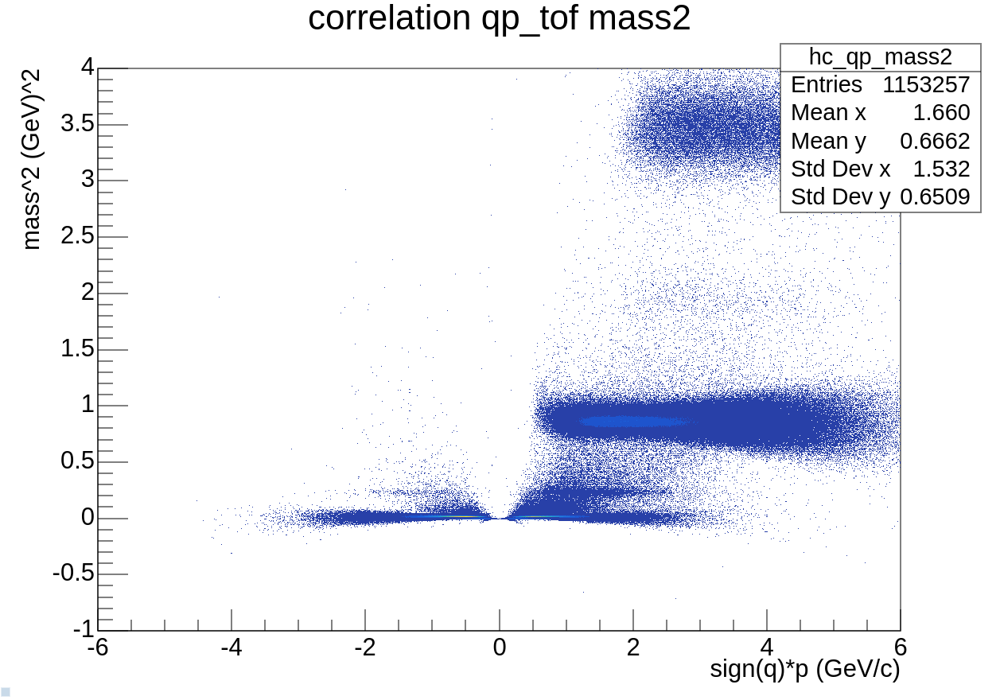
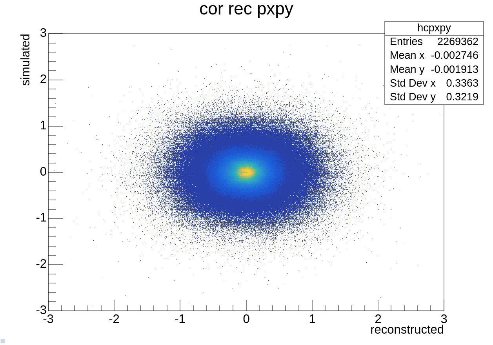
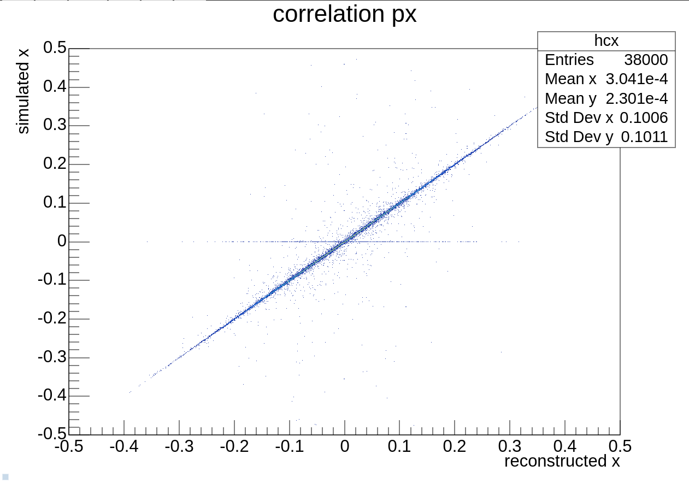

# cbmroot-starter

Experimenting with CBMRoot. 

Goals:
- try and generate a TOF plot
- find out how to get simulated and reconstructed data
- compile the macros and maybe hook up a debugger 

The first two targets have turned out to be relatively easy. I dug around in a fellow team member's old repositories and succesfully generated some fancy-looking plots (from the tof.C, momentum.C and event.C macros, respectively):






Data has been taken from a 3.3GeV Au-Au collision from the GSI `lustre` server.

Requires FairSoft, FairRoot and CBMRoot to run.

in order to run:
```
source <path-to-cbmroot-build-directory>/config.sh --prepend
```
then put the data in the `in/` directory and subsequently in the `macro/` directory, run:
```
ls ../in/* > filelist.txt
```
```
root <name-of-macro>
```
The macro will generate a .root file in the out directory.


Heavily based on macros by Julian Nowak at https://github.com/julnow/cbm_remote/tree/master/atree
